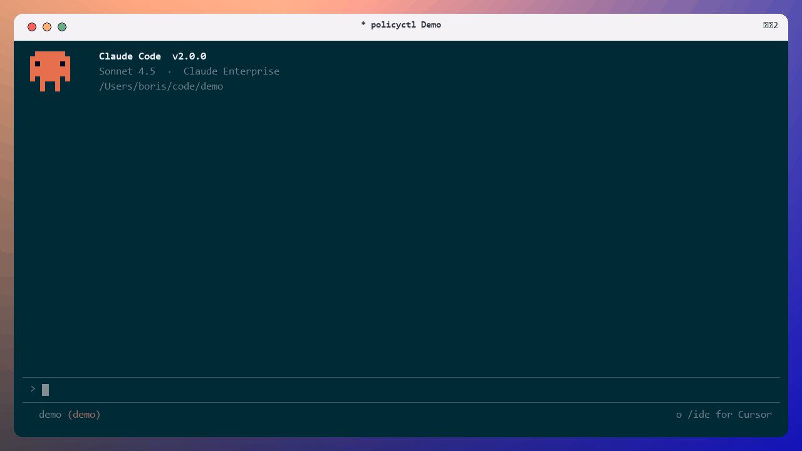

<p align="center">
  <a href="https://policyctl-web.pages.dev">
    
  </a>
</p>

<h1 align="center">policyctl</h1>

<p align="center">
  <strong>Provider-agnostic deterministic policy runtime for coding agents.</strong>
</p>

<p align="center">
  One <code>.policyctl.yml</code> specification enforced inside Claude Code, OpenAI Codex, Cursor, and CI pipelines.
</p>

<p align="center">
  <a href="https://policyctl-web.pages.dev"></a>
  <a href="https://policyctl-web.pages.dev/docs/"></a>
  <a href="https://github.com/RavaniRoshan/policyctl/actions/workflows/ci.yml"></a>
  <a href="https://www.npmjs.com/package/@policyctl/cli"></a>
  <a href="https://github.com/RavaniRoshan/policyctl/blob/main/LICENSE"></a>
</p>

---

<p align="center">
  
</p>

## Overview

Prompt-based advisory instructions (`CLAUDE.md`, `.cursorrules`, `AGENTS.md`) degrade as context windows fill up. Autonomous coding agents frequently overlook prompt rules, rewrite protected configuration files, leak secrets into diffs, or execute unauthorized commands.

**policyctl** provides a deterministic policy runtime that sits between the agent and your codebase. It intercepts tool calls at execution time, validates changes against compiled matchers and pattern tables in under 12ms, and rejects prohibited operations before files are modified on disk.

```
                  ┌────────────────────────┐
                  │ Autonomous Agent       │
                  │ (Claude / Cursor / CI) │
                  └───────────┬────────────┘
                              │ Pre-execution tool call
                              ▼
                  ┌────────────────────────┐
                  │ policyctl runtime      │
                  │ (.policyctl.yml)       │
                  └───────────┬────────────┘
                              │
               ┌──────────────┴──────────────┐
               ▼                             ▼
        [ ALLOW (exit 0) ]            [ BLOCK (exit 2) ]
        Action executed on disk       Interception feedback injected
                                      into agent prompt to self-correct
```

> [!NOTE]
> `policyctl` runs 100% locally, emits zero telemetry, requires no network calls, and operates entirely offline. An optional Cloud tier is available for teams needing shared policy versioning, live compliance feeds, and audit trails.

---

## Key Features

- **Zero LLM Drift:** Pure deterministic evaluation. The same input produces the exact same verdict every time.
- **Sub-12ms Evaluation:** Compiled matchers and pattern tables evaluate in `<12ms`, introducing zero perceptible latency to agent prompt loops.
- **Pre-Tool-Call Interception:** Intercepts file writes and shell executions *before* they touch the filesystem, preventing hallucinated bugs or secrets from ever being staged.
- **Single Source of Truth:** Author rules once in `.policyctl.yml`. The engine enforces them across Claude Code, Cursor, Codex, and CI.
- **Automated Hook Generation:** `policyctl gen <provider>` automatically writes the native hook configuration files for each supported agent.
- **Self-Guarding Policy:** Automatically creates an immutable rule blocking agents from modifying `.policyctl.yml` or hook settings.
- **CI Hard Gate:** The identical engine runs in GitHub Actions, GitLab CI, and custom Docker runners, failing pull requests on blocking violations.

---

## Getting Started

### Prerequisites

- Node.js `18.0.0` or higher
- Git `2.30.0` or higher

### Installation

Install the CLI globally or run it on demand with `npx`:

```bash
# Global install via npm
npm install -g @policyctl/cli

# Or run directly with npx
npx @policyctl/cli init
```

### Quickstart in 60 Seconds

1. **Scaffold a starter policy:**

   ```bash
   policyctl init --all
   ```

   This inspects your workspace, detects configured agents (Claude, Cursor, Codex), generates `.policyctl.yml`, and configures native hooks.

2. **Verify your setup:**

   ```bash
   policyctl doctor
   ```

3. **Simulate an enforcement check:**

   ```bash
   policyctl check --demo
   ```

4. **Integrate with GitHub Actions CI:**

   Add the policy check step to your workflow file (`.github/workflows/policy.yml`):

   ```yaml
   name: Policy Gate
   on: [pull_request, push]

   jobs:
     verify:
       runs-on: ubuntu-latest
       steps:
         - uses: actions/checkout@v4
           with:
             fetch-depth: 0
         - uses: actions/setup-node@v4
           with:
             node-version: 22
         - run: npx @policyctl/cli check --fail-on block,fail
   ```

---

## Policy Configuration (`.policyctl.yml`)

The `.policyctl.yml` file lives at the root of your repository.

```yaml
version: 1

rules:
  # Rule 1: Protect database migrations
  - id: migrations-via-generator
    description: "Database migrations must be generated via CLI, never handwritten."
    scope: both
    enforce: block
    when:
      path: "db/migrations/**"
    message: |
      Migration files cannot be authored directly by agents.
      Please run `make migration name=<name>` instead.

  # Rule 2: Intercept leaked credentials
  - id: no-secrets-in-diff
    description: "Block hardcoded API keys and credentials in code diffs."
    scope: diff
    enforce: block
    when:
      diff_regex: "(AKIA[0-9A-Z]{16}|ghp_[a-zA-Z0-9]{36}|sk-proj-[a-zA-Z0-9]{20,})"
    message: "Potential secret detected in diff. Use environment variables instead."

  # Rule 3: Require tests for core library modifications
  - id: require-companion-tests
    description: "Modifications to src/ must be accompanied by updates in test/."
    scope: diff
    enforce: fail
    when:
      diff_paths_glob: "src/**"
      diff_paths_not_glob: "test/**"
    message: "Source changes require companion test coverage in test/."

  # Rule 4: Self-guarding runtime configuration
  - id: guard-policy-files
    description: "Prevent autonomous agents from modifying policyctl configuration."
    scope: hook
    enforce: block
    when:
      path: "{.policyctl.yml,.claude/**,.cursor/**}"
    message: "Modifying policyctl configuration files requires human authorization."
```

---

## Enforcement Levels

Each rule specifies an `enforce` level that determines how the runtime handles a violation:

| Level | Exit Code | Hook Behavior (Claude / Cursor) | CI Behavior (GitHub Actions) | Use Case |
|---|---|---|---|---|
| `block` | `2` | **Blocks tool call immediately.** Injects remediation message into prompt. | Fails workflow run | Critical file protection, secrets, destructive commands |
| `fail` | `1` | Allows tool call during prompt iteration. | Fails workflow run | Missing companion tests, PR-level style requirements |
| `warn` | `0` | Displays advisory warning to agent prompt. | Logs warning (passes build) | Deprecation notices, non-blocking guidelines |
| `ignore` | `0` | Evaluated in debug traces only; no action taken. | Passes build | Rule testing and staging |

---

## Matchers Reference

`policyctl` includes 8 deterministic matchers that can be combined within any rule:

| Matcher | Scope | Description | Example |
|---|---|---|---|
| `path` | `hook`, `both` | Glob pattern matching the target file path. | `path: "packages/core/**"` |
| `command` | `hook` | Regex matching shell commands in agent terminal tools. | `command: "^(rm -rf|dropdb)"` |
| `tool` | `hook` | Matches specific tool calls by name or regex. | `tool: "Bash"` |
| `diff_contains` | `diff`, `both` | Matches literal text that must appear in the diff. | `diff_contains: "TODO: remove"` |
| `diff_not_contains` | `diff`, `both` | Requires a required substring to be present. | `diff_not_contains: "Generated by"` |
| `diff_regex` | `diff`, `both` | Regular expression evaluated against diff hunks. | `diff_regex: "AKIA[0-9A-Z]{16}"` |
| `diff_paths_glob` | `diff`, `both` | Asserts that files matching the glob were modified. | `diff_paths_glob: "src/**"` |
| `diff_paths_not_glob` | `diff`, `both` | Asserts that NO files matching the glob were touched. | `diff_paths_not_glob: "test/**"` |

> [!TIP]
> When multiple matchers are defined under `when`, they are evaluated using logical **AND**. All conditions must match for the rule to fire.

---

## Agent Hook Adapters

`policyctl` integrates directly into the execution lifecycles of leading agent tools:

### Claude Code
Interception hooks run via the `PreToolUse` lifecycle in `.claude/settings.json`. When `policyctl eval` returns exit code `2`, Claude Code halts the tool call before file execution and passes the error text into Claude's reasoning context.

```bash
policyctl gen claude
```

### Cursor
Native integration via `.cursor/hooks.json` and `.cursor/rules/policy.mdc`. Tool operations evaluate before agent execution, respecting `failClosed` security semantics.

```bash
policyctl gen cursor
```

### OpenAI Codex
Starlark rules generated for Codex environments via `exec-policy`:

```bash
policyctl gen codex
```

---

## CLI Commands

| Command | Syntax | Description |
|---|---|---|
| `init` | `policyctl init [--all]` | Scaffolds `.policyctl.yml` and generates agent hooks. |
| `check` | `policyctl check [--fail-on <levels>]` | Evaluates rules against git diff. Exits non-zero on violations. |
| `eval` | `policyctl eval --hook` | Evaluates a single tool call from stdin payload in `<12ms`. |
| `list` | `policyctl list` | Prints loaded rules, active scopes, and matchers. |
| `gen` | `policyctl gen <claude\|cursor\|codex>` | Generates provider hook configuration files. |
| `doctor` | `policyctl doctor` | Diagnostic audit verifying hook paths and CLI installation. |
| `trace` | `policyctl trace <path>` | Dry-run trace explaining which rules match a given file or tool call. |
| `test` | `policyctl test` | Runs assertion test suites against custom rule fixtures. |
| `login` | `policyctl login` | Authenticates with the hosted control plane. |
| `push` | `policyctl push` | Publishes local `.policyctl.yml` to shared cloud versioning. |
| `pull` | `policyctl pull` | Syncs the team policy from the cloud into the local repository. |
| `report` | `policyctl report` | Emits violation event metadata to the team audit feed. |

---

## Cloud Control Plane

For engineering organizations managing policies across dozens of repositories:

- **Cross-Repo Policy Versioning:** Maintain immutable, auditable policy versions with rollback capabilities.
- **Audit Feed & Live Sessions:** Real-time visibility into agent tool calls, blocked actions, and remediation outcomes.
- **Compliance Reports:** Daily compliance digests and CSV export streaming directly from Cloudflare Workers edge.
- **AI Rule Authoring:** Natural language prompt analysis that generates valid, typed `.policyctl.yml` rules.

```bash
# Connect local repository to team workspace
policyctl login
policyctl push
```

---

## Documentation & Community

- **Complete Documentation:** [policyctl-web.pages.dev/docs](https://policyctl-web.pages.dev/docs/)
  - [Tutorials: Getting Started](https://policyctl-web.pages.dev/docs/tutorials/getting-started/)
  - [How-To: Intercept Secrets](https://policyctl-web.pages.dev/docs/how-to/intercept-secrets/)
  - [Reference: CLI Commands](https://policyctl-web.pages.dev/docs/reference/cli-commands/)
  - [Explanation: Architecture](https://policyctl-web.pages.dev/docs/concepts/architecture/)
- **Bug Tracker & Issues:** [GitHub Issues](https://github.com/RavaniRoshan/policyctl/issues)
- **Web Platform:** [policyctl-web.pages.dev](https://policyctl-web.pages.dev)
